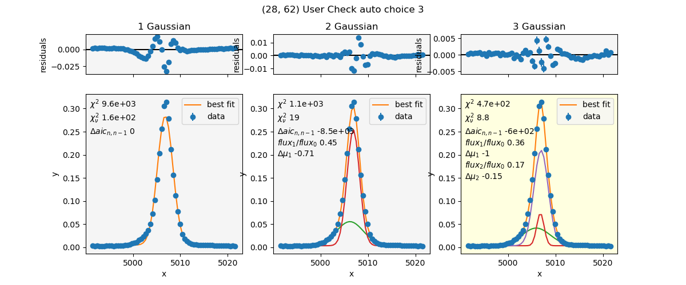

Fit emission lines
==================

:func:`threadcount.procedures.fit_lines.run`

This procedure will (if not already run separately) run the procedure to
:ref:`procedure_open_cube`. A smoothing kernel is generated to spatially smooth the image.
We use lmfit to fit specified functions to specified
emission lines in each spaxel.  Options are available to choose between multiple
fit functions for a given line, interactively if desired, as well as for
Monte Carlo iterations for a fit, and by that I
mean the line data is varied by a random amount determined by the variance, and
the fit is re-run, and the results of this operation are combined.

The results of this script are .txt and .pdf output files containing the fit
results.

The Variables in the
:mod:`threadcount.lines` module shows the predefined
wavelengths and Line instances. The variables beginning with "L\_" are the Line
objects used in the settings for the fit_lines procedure. See :class:`threadcount.lines.Line`
for an example to define your own.

Settings
--------

The settings required are those from :ref:`procedure_open_cube`, as well as more.
The new settings required, and their defaults (note this documentation is not
automatically generated so the required settings or defaults
may change with the rapidly changing code), is:

.. code:: python

    import threadcount as tc
    default_settings = {
        "setup_parameters": False,
        "monitor_pixels": [],
        "output_filename": "example_output",
        "save_plots": False,
        "region_averaging_radius": 1.5,
        "instrument_dispersion": 0.8,
        "lmfit_kwargs": {"method": "least_squares"},
        "snr_lower_limit": 10,
        "lines": [tc.lines.L_OIII5007],
        "models": [[tc.models.Const_1GaussModel()]],
        "d_aic": -150,
        "interactively_choose_fits": False,
        "always_manually_choose": [],
        "mc_snr": 25,
        "mc_n_iterations": 20,
    }

Here are explanations of each of the settings.

* **setup_parameters**: True or False. If True, only the monitor_pixels will be fit.
* **monitor_pixels**: list of (row, col) for pixels to track when setup_parameters is True.
  If setup_parameters is True and save_plots is True, then these pixels will have
  their fit plots saved, and it won't take very long.
* **output_filename**: The output files will begin with this string.
* **save_plots**: True or False, whether to save the plots. This takes a long time,
  if saving all the spaxels. Think ~0.5-1 hr per line fit.
* **region_averaging_radius**: units are in pixels. This is a float or a list of
  floats, where whose centers are within this radius from the center of the reference
  pixel will be averaged. This particular part of threadcount does support
  "elliptical" region averaging, so will work for non-square pixels. 

  .. note:: A list here will be in the form of [dx, dy], opposite to how python normally addresses
    pixel coordinates.

* **instrument_dispersion**: This will set a minimum sigma for fitted gaussians.
  Since we are de-redshifting... This dispersion will also be "de-redshifted",
  meaning divided by (1 + z) before being used to set the minimum sigma.
* **lmfit_kwargs**: a dictionary of arguments to pass to :meth:`lmfit.model.Model.fit` 
  with the exception of the keywords: params, x, weights.
* **snr_lower_limit**: Signal-to-noise ratio of cube before continuum subtraction,
  below which the spaxel will not be fit. The SNR is computed by the defaults of 
  :func:`threadcount.fit.get_SNR_map`. Specifically, the spectra from all the spaxels
  is summed, and a gaussian is fit to the
  selected line. A bandwidth is chosen, which is center +- 5 * sigma. For each spaxel,
  the SNR in that bandwidth is computed. This will be a different SNR value for each
  selected line.
* **lines**: a list of the lines to process. The entries must be of type
  :class:`threadcount.lines.Line`, where I have some presets created, but you can make
  your own.
* **models**: a list of lists, corresponding to which set of
  :class:`lmfit.model.Model` to fit to each line defined in lines. These can
  be any Model with a guess function defined, though much of this code has been
  designed around choosing how many gaussian components to use.
  
  .. note:: 
    
    * The models should be in order from least complex to most complex 
      for each line.
    * The automatic choosing between models only works with 3 or less.

* **d_aic**: This parameter, which is shorthand for "delta AIC", is used in the
  function :func:`threadcount.fit.choose_model_aic_single` to choose between models when
  a line has been fit with more than one model.
* **interactively_choose_fits**: After the automatic choosing has happened, another
  function is run to see if a user should inspect the fit. That function is called
  :func:`threadcount.fit.marginal_fits`. If interactively_choose_fits is True, then
  for each pixel selected as True by :func:`~threadcount.fit.marginal_fits`,
  an plot will be displayed, and the user will enter in the terminal which fit
  they select.
* **always_manually_choose**: a list of spaxels in (row, column) order to always
  set to True after :func:`~threadcount.fit.marginal_fits`, meaning that you will
  always see the interactive plot for these. Helpful for setup or for problematic
  pixels that you see in the output images
* **mc_snr**: The signal-to-noise ratio below which Monte Carlo iterating will be
  done.
* **mc_n_iterations**: The number of Monte Carlo iterations to do.

Outputs
-------

The main results of this script are .txt and .pdf output files containing the fit
results. For each line analyzed, you might have:

* simple_model.txt
* best_fit.txt
    -- Only output if there is more than one model for this line.
* mc_best_fit.txt
* fits_user_checked.pdf
    -- Only output if any pixels were flagged for the user
    to choose between multiple fits. This file is output whether or not the settings
    "interactively_choose_fits" is True or False.
* fits_all.pdf

The settings dictionary that is passed in will be updated with some more information.
If we call the settings dict *settings*, then::

  settings["instrument_dispersion_rest"] = settings["instrument_dispersion"]/ (1 + settings["z_set"])
  settings["kernel"] # numpy array of the smoothing kernel.
  settings["comments"] # info appended to comments includes:
    [
    "instrument_dispersion",
    "region_averaging_radius",
    "snr_lower_limit",
    "mc_snr",
    "mc_n_iterations",
    "lmfit_kwargs",
    "d_aic",
    "units" # settings["cube"].unit
    ]

.. _fit_lines_example:

Example
-------

.. contents:: Contents
   :depth: 3
   :local:
   :backlinks: none

Here I will run an example script which will load a cube (without interactive
tweak_redshift), then fit 2 emission lines, [OIII] 5007, and H Beta.  For the
5007 line, I will fit 3 different models, each containing a constant and 1,2,or 3
Gaussian components. The H beta line will be fit with only 1 Gaussian component.

For ease of demonstration, I will have "setup_parameters" : True, and choose
some "monitor_pixels" and some "always_manually_choose" pixels. These are not
chosen for any reason of demonstration, they are basically just random. Here is
the script I will run, and below that, I will show the ipython output and
interaction.

.. note:: Change fit_settings["setup_parameters"] to False in order to run fits
   for all the spaxels. This will take 1-2 hours, especially with
   fit_settings["save_plots"] = True.

Script
^^^^^^
Download here: :download:`ex2.py <examples/ex2.py>`

.. include:: examples/ex2.py
  :code:

ipython session
^^^^^^^^^^^^^^^

Make sure you have all 3 of the input files
(MRK1486_red_metacube.fits, MRK1486_red_varcube.fits, Red_Cont_PPXF_original.fits)
as well as ex2.py in the current directory.

.. code:: ipython

   In [1]: %run ex2.py
    function extend_lmfit has been run
    WARNING: MpdafUnitsWarning: Error parsing the BUNIT: 'FLAM16' did not parse as unit: At col 0, FLAM is not a valid unit. Did you mean flm? If this is meant to be a custom unit, define it with 'u.def_unit'. To have it recognized inside a file reader or other code, enable it with 'u.add_enabled_units'. For details, see https://docs.astropy.org/en/latest/units/combining_and_defining.html [mpdaf.obj.data]
    WARNING: FITSFixedWarning: 'datfix' made the change 'Set MJD-OBS to 58930.000000 from DATE-OBS.
    Set MJD-BEG to 58930.458301 from DATE-BEG.
    Set MJD-END to 58930.462930 from DATE-END'. [astropy.wcs.wcs]
    WARNING: MpdafUnitsWarning: Error parsing the BUNIT: 'FLAM16' did not parse as unit: At col 0, FLAM is not a valid unit. Did you mean flm? If this is meant to be a custom unit, define it with 'u.def_unit'. To have it recognized inside a file reader or other code, enable it with 'u.add_enabled_units'. For details, see https://docs.astropy.org/en/latest/units/combining_and_defining.html [mpdaf.obj.data]
    WARNING: FITSFixedWarning: 'datfix' made the change 'Set MJD-OBS to 58930.000000 from DATE-OBS.
    Set MJD-BEG to 58930.458301 from DATE-BEG.
    Set MJD-END to 58930.462930 from DATE-END'. [astropy.wcs.wcs]
    WARNING: MpdafUnitsWarning: Error parsing the BUNIT: 'FLAM16' did not parse as unit: At col 0, FLAM is not a valid unit. Did you mean flm? If this is meant to be a custom unit, define it with 'u.def_unit'. To have it recognized inside a file reader or other code, enable it with 'u.add_enabled_units'. For details, see https://docs.astropy.org/en/latest/units/combining_and_defining.html [mpdaf.obj.data]
    WARNING: FITSFixedWarning: 'datfix' made the change 'Set MJD-OBS to 58930.000000 from DATE-OBS.
    Set MJD-BEG to 58930.458301 from DATE-BEG.
    Set MJD-END to 58930.462930 from DATE-END'. [astropy.wcs.wcs]
    Processing line [OIII] 5007
    Finished the fits.
    ==============================================
    ====== Manual Checking procedure =============
    ==============================================
    The software has determined there are 3 fits to check. If cancelled, the automatic choice will be selected. At any point in the checking process you may cancel and use the automatic choice by entering x instead of the choice number.
    Would you like to continue manual checking?  [y]/n 

The console is waiting for user input.

This point is an alert to you of how many plots you are about to have to look at.
We will just hit <Enter> to continue with the default choice, y.

Note, you will be able to cancel the interactive portion at any point, so there
is no harm to choosing yes.

If you choose to enter n then you will not see any plots, and the automatic
guesses will be chosen for the processing to continue.  (This is the
same effect as having the setting "interactively_choose_fits" = False.) 
The file ex2_5007_fits_user_checked.pdf would still be
output, so you can go back later and see what you might have changed.

.. code:: ipython

   In [1]: %run ex2.py
    |...<snip>
    Would you like to continue manual checking?  [y]/n   
    Please enter choice 1-3, or x to cancel further checking.
    Invalid options will keep default choice.
    Leave blank for default for pixel (28, 62) [3]:

A plot for spaxel (28,62) has popped up (shown above), and the console is waiting for user input.

The structure of this plot is this: the setting for this line (5007) had 3 models:
[tc.models.Const_1GaussModel(), tc.models.Const_2GaussModel(),
tc.models.Const_3GaussModel()], in order from least complex to most complex.
Each column starts out with a plotting function similar to
:meth:`lmfit.model.ModelResult.plot`, showing the fit and residuals with error
bars. I have added extra information to each plot, including:

* Highlight: Which fit has been automatically selected as the "best" fit.
* Fit Components: The gaussian fit components have been plotted,
  with the constant added, for the purpose of aiding in visual inspection.
* Chi square and reduced chi square: reported from lmfit.
* delta AIC: The change in aic(real) between a fit and the one directly to its 
  left. That was the intention with the notation n,n-1.
* For multiple gaussian components: I have reported fit component information
  relative to the "main" gaussian which I defined as the one with the highest
  flux. I printed flux ratios and the shift in center wavelength from the "main"
  component.

The idea here is that the user will visually examine this plot and select the
"best" fit given all the information presented. There has been an auto-selection
process, and that algorithm has chosen that the right fit is the best. It is
highlighted yellow, Has "3" mentioned in the title, and is the default choice in
the console ("[3]").  The instructions explicitly give the range 1-3 as options
to enter. What I'm trying to say, is that this is 1-based, not 0-based as usual
python indexing.

For the purpose of this demonstration, we are going to choose the middle plot as
our favorite. So, in the console, enter 2.

.. code:: ipython

   In [1]: %run ex2.py
    |...<snip>
    Leave blank for default for pixel (28, 62) [3]:  2
    Please enter choice 1-3, or x to cancel further checking.
    Invalid options will keep default choice.
    Leave blank for default for pixel (29, 63) [-1]:

The plot of the last spaxel should have automatically closed, and a new plot has
popped up. A plot that looks like this means that the spaxel was not fit, usually
due to lower than the threshold setting of signal-to-noise. The flag for this
is a "choice" of -1. So in the console, we will just hit Enter to keep the default.

.. code:: ipython

   In [1]: %run ex2.py
    |...<snip>
    Leave blank for default for pixel (29, 63) [-1]:
    Please enter choice 1-3, or x to cancel further checking.
    Invalid options will keep default choice.
    Leave blank for default for pixel (48, 58) [3]:

.. image:: examples/ex2_Figure_3.png
  :width: 600

Again, the last plot should have closed, and this new one popped up. We'll just
keep the default for demonstration purposes. Hit Enter in the console.

.. code:: ipython

   In [1]: %run ex2.py
    |...<snip>
    Leave blank for default for pixel (48, 58) [3]:
    Saving plots to ex2_5007_fits_user_checked.pdf, this may take a while.
    Finished saving to ex2_5007_fits_user_checked.pdf
    Saving plots to ex2_5007_fits_all.pdf, this may take a while.
    Saved 100/6300
    |...<snip>
    Finished saving to ex2_5007_fits_all.pdf
    Processing line Hβ
    Finished the fits.
    No user checked pixels. Skipping save user checked plots.
    Saving plots to ex2_Hbeta_fits_all.pdf, this may take a while.
    Saved 100/6300
    |...<snip>
    Finished saving to ex2_Hbeta_fits_all.pdf

The rest of this should have finished quickly for this demonstration.

Example 2 Script Output
^^^^^^^^^^^^^^^^^^^^^^^

At this point, you should now have output files named:

* ex2_5007_simple_model.txt
* ex2_5007_best_fit.txt
* ex2_5007_mc_best_fit.txt
* ex2_5007_fits_user_checked.pdf
* ex2_5007_fits_all.pdf
* ex2_Hbeta_simple_model.txt
* ex2_Hbeta_mc_best_fit.txt
* ex2_Hbeta_fits_all.pdf

Images output
"""""""""""""

**..._fits_all.pdf**

So, lets examine ex2_5007_fits_all.pdf. These are plots for each of the spaxels
that were fit in the procedure. The final page contains a list of all the pixels
that were not fit, for the intended purpose that you could search for the text
of the spaxel coordinates and find it. The highlight colors of the panels are
blue and yellow.

  * yellow = automatic choice by the aic algorithm.
  * blue = User choice. -- The blue overrides the yellow, and both are shown for
    record-keeping purposes.

The plots may have only blue, only yellow, or both blue and yellow panels. This
is what each of those means:

  * blue only: The user was to have checked this spaxel, and they verified that
    the aic algorithm's choice is correct. (Blue-only occurs for any spaxel the
    user would have checked if they did interactive checking, whether or not
    they *actually* looked at the fit.
  * yellow only: These pixels were not flagged for user inspection. They have
    been auto-selected.
  * blue and yellow: The user has chosen a different fit compared to the fit
    chosen by the algorithm.

**..._fits_user_checked.pdf**

ex2_5007_fits_user_checked.pdf contains a subset of the plots in ..._fits_all.pdf.
The subset are the pixels flagged for user verification of the model choice,
whether or not the user actually interacted.

Txt files output
""""""""""""""""

The general structure of the .txt file output is this: a header which is the "comment"
attribute of the settings (which is appended to as the processing progresses)

The final line of the header is the column labels. In general, these will likely
begin with "row" and "col", followed by the SNR of that spaxel.

The data output is float formatted with :const:`threadcount.fit.FLOAT_FMT`, which
at the time of this writing is '.8g'. Therefore, any missing data (e.g. fit info
for spaxels that did not meet the SNR cutoff) will contain the entry 'nan'.

The **units** of the output: The cube units are included in the header. This is
the units of the height, meaning that the flux will have units * Angstrom. All
wavelength units are intended to be Angstrom.

**ex2_5007_simple_model.txt**

The _simple_model.txt file contains the fit to the first entry in the models list
for that line, often a constant + 1 gaussian model.

Header without column names::

  # data_filename: MRK1486_red_metacube.fits
  # z_set: 0.03386643885613516
  # image_aspect: 1.0
  # wcs_step: [0.291456 0.291456]
  # observed_delta_lambda: 0.5
  # instrument_dispersion: 0.8
  # region_averaging_radius: 1.5
  # snr_lower_limit: 10
  # mc_snr: 25
  # mc_n_iterations: 20
  # lmfit_kwargs: {'method': 'least_squares'}
  # d_aic: -150
  # units: 1e-16 erg / (Angstrom cm2 s)

This has recorded many of the settings that were set when running this procedure.
The wcs_step is in arcsec, and the observed_delta_lambda is in Angstroms. Both were
both taken from the header of the data_filename fits file. z_set is the z actually
used in the processing. The units are taken from the cube header as well, Since
at this point we haven't changed the overall scaling of the data. image_aspect is
the ratio fo the wcs_step, and is there for ease of passing to matplotlib for
non-square pixels.

Columns can be grouped into 3 sections:

* Spaxel info:

  * row -- python index of spaxel row
  * col -- python index of spaxel column
  * snr -- the signal-to-noise ratio of that spaxel

* ModelResult attributes, from lmfit or :mod:`threadcount.lmfit_ext`:

  * aic_real -- the fit aic_real
  * bic_real -- the fit bic_real
  * chisqr -- the fit chi square
  * redchi -- the fit reduced chi square
  * success -- (1 or 0) whether the fit succeeded or not.

* Parameter values. These are the model parameter values and stderr from the fit.

  * c
  * c_err
  * g1_center
  * g1_center_err
  * g1_flux
  * g1_flux_err
  * g1_fwhm
  * g1_fwhm_err
  * g1_height
  * g1_height_err
  * g1_sigma
  * g1_sigma_err

**ex2_5007_best_fit.txt**

The header of this file is the same as the previous file.

Additional columns:

* Spaxel info:

  * choice -- This is which model was picked as best. The values may be -1,
    indicating no fits were valid, or 1-3, indicating which of our 3 models was
    chosen.

* Parameter values.

  * The column labels for parameter values are made using the most complex model.

**ex2_5007_mc_best_fit.txt**

The header of this file is the same.

Columns:

* Spaxel info:

  * row, col, snr
  * choice -- optional column, only if there's more than 1 entry in models.

* ModelResult attributes. These have been median combined from all the Monte
  Carlo iterations, with the exception of "success", which is always meaned.
  That way, you'll know what fraction of the fits succeeded.

  * success
  * chisqr
  * redchi

* Parameter values. Each parameter will have 3 values reported. So for example, 
  lets look at parameter *c*. All the parameters of the most complex model will
  be listed, with all 3 of these entries each.
  
  * "avg\_c": The average value
    of c for all the Monte Carlo iterations (computed via median).
  * "std\_c": The standard deviation of c's value from all the iterations.
  * "avg\_c\_err": The average value of c's stderr from each fit (computed via
    median).

Troubleshooting
---------------

Once the fit_lines procedure has completed,
An array of the lmfit ModelResults is saved in the settings dictionary.

If the procedure was run in an interactive shell like IPython or Jupyter, you will
still have access to the settings dictionary.

Read in lmfit about :class:`~lmfit.model.ModelResult` and what you can learn.

For example, to view the fit and initial guess for pixel (y,x) for the 
model of index 1 (in array of models to fit):

.. code:: python

    settings['model_results'][1, y, x].plot(show_init=True)