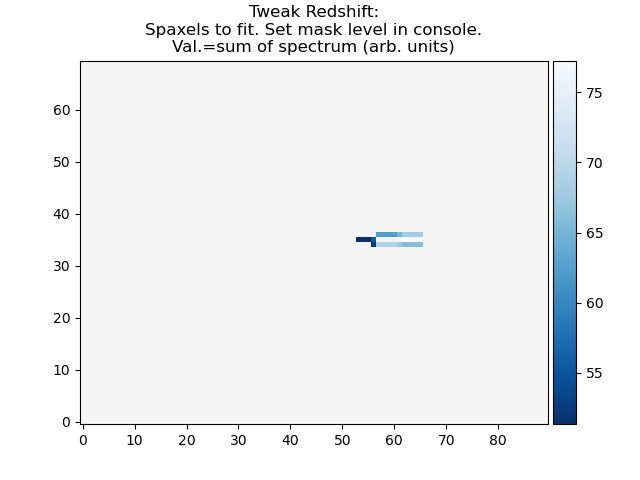
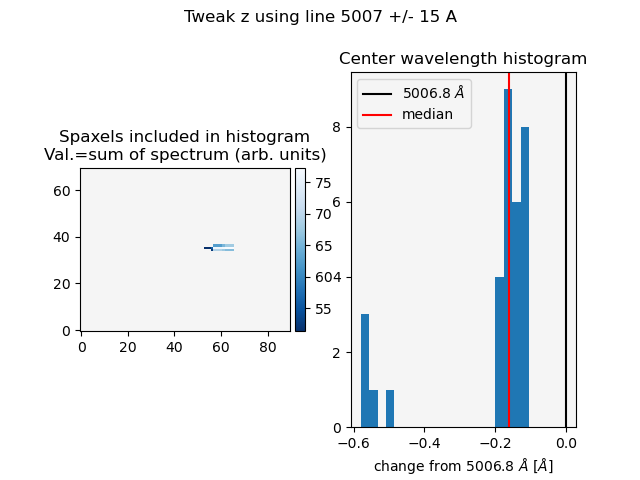

.. _procedure_open_cube:

Open and de-redshift a spectral cube
------------------------------------

:func:`threadcount.procedures.open_cube_and_deredshift.run`

This procedure results in a data file being opened into the mpdaf cube format.
We also modify the mpdaf cube's wave property to be de-redshifted.

Here is a python script file that you should be able to copy and run if you have
the named data file in the same directory as the script, which I have named ex1.py.

.. include:: examples/ex1.py
  :code:

The settings available in this script are:

* "data_filename" -- string of the file name of the data cube.
* "data_hdu_index" -- int, or None to have the program attempt to auto-identify.
    -- This is the index of the fits header data unit containing the data.
* "var_filename":  -- string of the file name of the variance cube, or None.
    -- Note: this may sometimes be the same as the data_filename, and sometimes not.
* "var_hdu_index": -- int, or None to have the program attempt to auto-identify.
    -- This is the index of the fits header data unit containing the variance.
* "continuum_filename": string of the file name of the continuum cube. The
  hdu index of this is assumed to be 0.
* "z": -- float, the redshift of the object.
* "setup_parameters": bool, whether to run the interactive tweak_redshift procedure.
* "comment": string. A string that will be saved to the top of txt output files.
  This will be appended to as more processing steps occur.

The absolute minimum settings needed are 'data_filename' and 'z'. For this script,
if 'setup_parameters' is True, then an interactive "tweak redshift" procedure
will be run. I'll demonstrate that below. If 'setup_parameters' is False, then
the 'z' from the input will be used, and no interactive procedure will be started.

Another example of how to use these settings is included in the Fit Lines
:ref:`fit_lines_example`.

Tweak redshift
^^^^^^^^^^^^^^

Read more about this procedure at :func:`threadcount.fit.tweak_redshift`.

  * The first image that is shown is a spatial image of the object, where each spaxel
    value is the flux around a narrow wavelength range around 5007 Angstrom.
    There is a cutoff in
    the intensity, below which the spaxels are not displayed.
    The idea is that you will want to use only the brightest spaxels,
    i.e. the galaxy center, to calculate the redshift of the object. The console
    will report the current cutoff value, and ask if you'd like to change it.

  * You can change the cutoff value any number of times.

  * Adjust the cutoff value until only the "galaxy" spaxels are shown.

  * Press Enter to begin the next step: fitting.

  * The code will fit a gaussian to each selected spaxel. Then, plot a histogram
    containing the center wavelengths of the fits. The ideal histogram shape would
    be a double-horned shape centered on 0, with some pixels being offset negatively from the
    center, and some being offset positively. 

  * A red vertical line will show the median wavelength shift from the ideal center
    and a suggested new z will be shown. This new z is calculated so that the red
    line would shifted 0 from the ideal line center.

  * user interaction is requested in the terminal to either accept or ignore this
    new z value. The selected value is saved into z_set, and the cube is correctly
    redshifted to z_set.

Here is an example of the output, if run from iPython:

.. code:: ipython

   In [1]: %run ex1.py
   function extend_lmfit has been run
   WARNING: MpdafUnitsWarning: Error parsing the BUNIT: 'FLAM16' did not parse as unit: At col 0, FLAM is not a valid unit. Did you mean flm? If this is meant to be a custom unit, define it with 'u.def_unit'. To have it recognized inside a file reader or other code, enable it with 'u.add_enabled_units'. For details, see https://docs.astropy.org/en/latest/units/combining_and_defining.html [mpdaf.obj.data]
   WARNING: FITSFixedWarning: 'datfix' made the change 'Set MJD-OBS to 58930.000000 from DATE-OBS.
   Set MJD-BEG to 58930.458301 from DATE-BEG.
   Set MJD-END to 58930.462930 from DATE-END'. [astropy.wcs.wcs]
   ====================================
   Tweak reshift procedure has started.
   ====================================
   |
   |
   Using line 5007 +/- 15 A
   Change the threshold for valid pixels.
   You may try multiple thresholds. Leave the entry blank and press Enter to confirm your choice.
   current limit: 2.5943482418460424
   Set new limit: (or leave blank and press Enter to continue)

.. image:: examples/ex1_Figure_1.png
  :width: 400

At this point, enter 50 into the console like so (starting with the final line
from above) and press enter. The figure should be refreshed with a new limit.

.. code:: ipython

   In [1]: %run ex1.py
   |...<snip>
   Set new limit: (or leave blank and press Enter to continue)  50
   Change the threshold for valid pixels.
   You may try multiple thresholds. Leave the entry blank and press Enter to confirm your choice.
   current limit: 50.0
   Set new limit: (or leave blank and press Enter to continue)

Press Enter without entering any information to confirm your choice.

.. code:: ipython

   In [1]: %run ex1.py
   |...<snip>
   Set new limit: (or leave blank and press Enter to continue)
   Fitting selected spaxels with gaussian model...
   Redshift from input settings (for reference)        : 0.0339
   Redshift calculated from the median of the fit centers: 0.03386685874525375
   Do you want to update the redshift with the calculated value 0.03386685874525375 ([y]/n)?

Press Enter to use the newly calculated redshift, or enter n to use the original
redshift.  Here, I'll press Enter.

.. code:: ipython

   In [1]: %run ex1.py
   |...<snip>
   Do you want to update the redshift with the calculated value 0.03386685874525375 ([y]/n)?
   Tweak reshift procedure is finished. The redshift has been updated to 0.03386685874525375

Now, you can examine the variables set in the script, in this case, the dictionary
user_settings.

.. code:: ipython

   In [2]: user_settings
   Out[2]:
   {'data_filename': 'MRK1486_red_metacube.fits',
   'data_hdu_index': None,
   'var_filename': None,
   'var_hdu_index': None,
   'continuum_filename': None,
   'z': 0.0339,
   'setup_parameters': True,
   'comment': 'data_filename: MRK1486_red_metacube.fits\nz_set: 0.03386685874525375\nimage_aspect: 1.0\nwcs_step: [0.291456 0.291456]\nobserved_delta_lambda: 0.5',
   'observed_delta_lambda': 0.5,
   'wcs_step': array([0.291456, 0.291456]),
   'image_aspect': 1.0,
   'z_set': 0.03386685874525375,
   'cube': <Cube(shape=(1750, 70, 90), unit='1e-16 erg / (Angstrom cm2 s)', dtype='None')>,
   'continuum_cube': None}

Inside iPython, you now have access to the mpdaf cube object, via
user_settings['cube']. You also have a record of the redshift that was actually
used, rather than what was input. user_settings['z_set']. 

This procedure returns a dictionary, which consists of the input dictionary,
any default settings that were not input with the dictionary, and some added
results of the procedure. The new informative keys are:

  * observed_delta_lambda = original wavelength step from image header.
  * wcs_step = pixel scale in arcsec, in the order  [dy,dx]
  * image_aspect = aspect to pass to matplotlib imshow in case of non-square pixels.
  * z_set = The redshift actually used, in case it was modified from the input
    during this procedure. 
  * comment = information has been appended, with the idea that saved output files
    may contain this information. It includes the above information as well as
    the input data_filename
  * cube = The actual reference to the data that has been loaded.
  * continuum = A reference to the continuum cube that was also loaded, or None.
