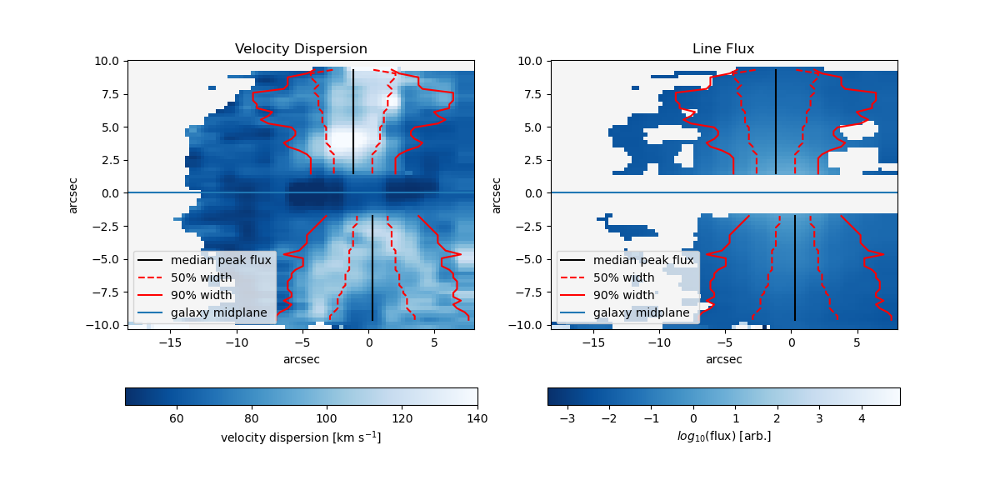
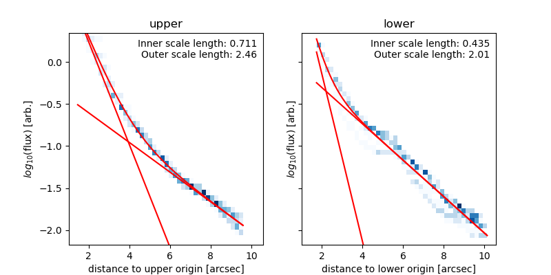
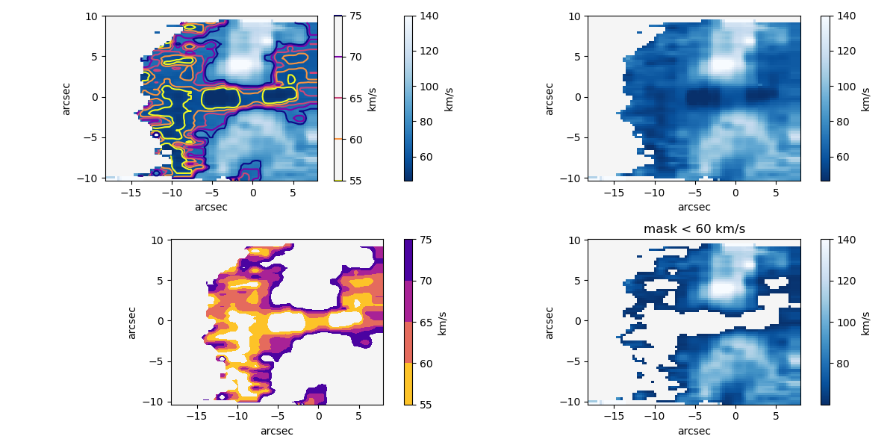
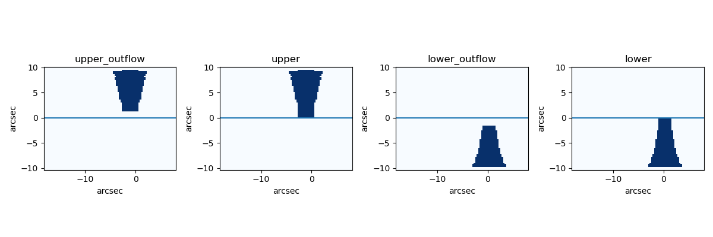
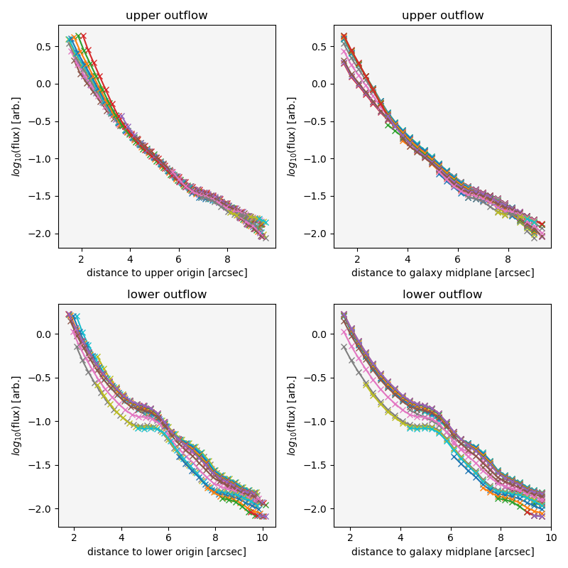

Measure Outflow extent
======================

:func:`threadcount.procedures.analyze_outflow_extent.run`

This procedure is limited at this time. A major assumption is that the 
galaxy will be horizontal in the image.

Procedure Description
---------------------

1. Load the input file, which is ideally an output file from
   :func:`threadcount.procedures.fit_lines.run`. 
   
   1. Load the data. The columns used are:

      * row, col
      * snr
      * g1_center, g1_flux, g1_sigma

   2. Load fields from the input file header (not fits header), if these
      analyze_settings say "header":  

      * arcsec_per_pixel
      * units

2. Convert sigma to velocity dispersion.

3. Boxcar smooth the flux vertically using a boxcar of 
   analyze_settings["vertical_average_region"] pixels. Here is one of the places
   a horizontal galaxy in the image is assumed.

4. Set up galaxy geometry:

   1. Galaxy center row: This overrides the
      analyze_setting["galaxy_center_pixel"] row.  Compute the row containing the
      center plane of the galaxy. This is done by
      computing the maximum row for each column, and taking the median. I have a
      restriction where the only the pixels above the median SNR of the
      entire image are included in this calculation.

   2. Galaxy center column: Use the setting from
      analyze_setting["galaxy_center_pixel"] col.

   3. Set up "extent" for matplotlib imshow viewing, using the galaxy center,
      to have relative arcsec
      dimensions instead of pixel numbers labeling the x and y axis.

5. If analyze_settings["verbose"] = True, Plot some images to help in choosing
   "velocity_mask_limit". This plot contains 4 panels all showing the veloocity
   dispersion. For velocity dispersion
   images, the matplotlib imshow keyword
   vmax is set to analyze_settings["velocity_vmax"].

   The left 2 images show different ways of viewing contours of velocity
   dispersion. The left top images shows just the velocity dispersion image.
   The left bottom image shows the regions masked out by the current choice of
   "velocity_mask_limit".

   I believe the idea behind the mask is to block out the main galaxy region.

6. Using only the unmasked pixels from the bottom left image, we will now create
   a set of masks to define the region of the outflow. The "manual_galaxy_region"
   will also be masked out at this point.

   1. Calculate the contours given by "contour_levels". This algorithm is as follows:

      1. Calculate, for the top have and bottom half of the image, the average
         column containing the brightest pixels in the row.
         Calculate the column containing the maximum flux for every row. Sigma clip
         these indices at 2 sigma to remove outliers. Compute the median of the
         remaining column indices for the top half and bottom half separately,
         where "half" is defined  as above/below the computed galaxy center row.
      
      2. For every row, calculate the total flux. Then, starting from the center
         column as determined in the previous step, step out symmetrically until
         the sum of the selected pixels is above the contour levels fraction
         specified. These are your contour regions.

   2. Convert units from pixels to arcsec from galaxy center, and save file 
      to ..._outflow_width_prof.txt

   3. Create masks using the contour specified in "outflow_contour_level", which
      must have been one of the options in "contour_levels". These masks are
      displayed in a figure if "verbose" is True. The "upper_outflow" and
      "lower_outflow" masks are created as I described. While the "upper" and
      "lower" masks are the same, but extend vertically to the galaxy center plane.
      Currently, "upper" and "lower" are not used.

7. Plot the contours over the velocity dispersion and line flux, and save the
   figure to ..._outflow_width_prof.pdf.

8. If verbose is True, plot 4 panel surface brightness profiles.  The "upper origin"
   is defined as the row of the galaxy midplane and the center column of the upper
   outflow. And the corresponding for the "lower origin". For each of these panels,
   one colored line represents a column of the image. The titles indicate which
   mask was applied to select the valid pixels for the plot,
   corresponding to the names from the 4 panel mask figure. 

   For the left panels, the x coordinate is the radial distance of a pixel to the
   "origin". For the right panels, the x coordinate is the vertical distance to
   the galaxy midplane. The y coordinate is the log10(flux) for each pixel.

   We have selected the left set as the data to move forward with and fit with
   a double exponential decay.

9. Fit a double exponential decay model to the surface brightness profile,
   log10(flux) vs distance to upper or lower origin, using lmfit. Print a lmfit
   fit_report as well as the r_50 and r_90 for each upper and lower outflow. The
   r_50 and r_90 are the radii at which 50% or 90% of the total flux is contained.
   This is in units or arcsec.

   Save the text file with the fit_report to ..._sb_prof_fitresults.txt and save
   the corresponding images to ..._sb_prof_fitresults.pdf.

Input/Output
------------

Input
^^^^^

The settings required for this procedure and their defaults are shown below.
(note this documentation is not
automatically generated so the required settings or defaults
may change with the rapidly changing code)

.. code:: 

  default_settings = {
      "one_gauss_input_file": "ex_5007_simple_model.txt",
      "velocity_mask_limit": 60,
      # manual_galaxy_region format
      # [min_row, max_row, min_column, max_column] --> array[min_row:max_row+1,min_column:max_column+1]
      # 'None' means it will continue to image edge.
      "manual_galaxy_region": [30, 39, None, None],
      "verbose": True,
      "vertical_average_region": 1,
      "contour_levels": [0.5, 0.9],
      "outflow_contour_level": 0.5,  # Select from contour_levels list which contour to choose to define outflow region.
      "output_base_name": "",
      "arcsec_per_pixel": 0.291456,
      "galaxy_center_pixel": [35, 62],  # row,col
      "velocity_vmax": 140,
      "units": None,
  }

Here are explanations of each of the settings.

* **one_gauss_input_file**: Intended to be the output from the
  :func:`threadcount.prodecures.fit_lines.run` procedure, where the model
  fit contains one gaussian component.
* **velocity_mask_limit**: The velocity dispersion (in km/s) below which the
  pixels will be masked out.  See step 5 above.
* **manual_galaxy_region**: This is the pixel coordinates of the region of the
  "galaxy", that you want to manually exclude from further calculations.
  This list is a region in the form of: [min_row, max_row, min_column, max_column]
  which will be used as: array[min_row:max_row+1,min_column:max_column+1].
  The entry None will continue the region to the edge. Setting the min and max
  equal to the same values will essentially turn off this feature, e.g. [0,0,0,0]
* **verbose**: Whether to show the extra plots.
* **vertical_average_region**: See step 3 above. The number of pixels to include
  in boxcar averaging, which happens only in the vertical direction.
* **contour_levels**: a list of floats < 1. See step 6.1. These are the contours
  to be calculated and displayed in ..._outflow_width_prof.txt/pdf, of the location
  in each row containing that fraction of flux.
* **outflow_contour_level**: choose from among contour_levels which coutour will
  be used to define the outflow.
* **output_base_name**: the output files will begin with this string.
* **arcsec_per_pixel**: float. If this entry is None, "header", or "auto", the
  header of the one_gauss_input_file will be read, and the first entry of the line
  beginning with "wcs_step:" will be used.
* **galaxy_center_pixel**: indices in row, column order. The row will actually be
  re-determined in the code, so it is unimportant at this point.
* **velocity_vmax"**: The matplotllib.imshow parameter vmax for displaying the
  velocity dispersion images.
* **units**: Currently unused. The units of the data. If this entry is None, "header", or "auto", the
  header of the one_gauss_input_file will be read, and string following "units:"
  will be passed to astropy to create an astropy Unit.

Output
^^^^^^

The output of this script is 4 files: 2 images and 2 text files.

* outflow_width_prof.pdf -- Image showing the contours on the velocity dispersion
  map and the flux map
* outflow_width_prof.txt -- Txt file defining the contour positions seen on the
  corresponding image. 
* sb_prof_fitresults.pdf -- Image of the surface brightness profiles of each
  upper/lower outflow, with double exponential fits.
* sb_prof_fitresults.txt -- Fit report displaying the fit details.

Processing Only Example
-----------------------

.. contents:: Contents
   :depth: 3
   :local:
   :backlinks: none

This example uses an input file that is the result of the procedure fit_lines.
ex3_5007_simple_model.txt, so ensure that file is in the same folder as ex3.py.
To see an example of running one script for both
fitting and processing, see the "Full Example", below.

Script
^^^^^^

.. include:: examples/ex3.py
  :code:

ipython session
^^^^^^^^^^^^^^^

.. code:: ipython

  In [1]: %run ex3.py
  function extend_lmfit has been run
  prefix/lib/python3.9/site-packages/threadcount/procedures/analyze_outflow_extent.py:649: UserWarning: Warning: converting a masked element to nan.
    max_flux_in_column = np.array(
  prefix/lib/python3.9/site-packages/threadcount/procedures/analyze_outflow_extent.py:595: UserWarning: Warning: converting a masked element to nan.
    contour_output = np.array(contour_output).T

Now, 2 images should pop up, and the command line is paused, waiting for the
images to be closed, but all the calculations and file-saving will have
already happened. One the images are closed, one more line "Finished with script"
will be printed. No information from the script is returned from the function.

Output
^^^^^^^

The below 2 images have been saved to pdf files, with corresponding txt files.

* ex3output_outflow_width_prof.pdf, ex3output_outflow_width_prof.txt
* ex3output_sb_prof_fitresults.pdf, ex3output_sb_prof_fitresults.txt

See Step 7 in Procedure Description for information:

See Step 9:

If you were to run ex3.py with the option analyze_settings["verbose"] = True,
then 3 additional plots will be displayed (not saved).

See Step 5:

See Step 6.3:

See Step 8:

Full Example
-------------

This example shows a full set of processing, going from fits files, to line fitting,
to contours. Complete with automatically filling
in the analysis settings computed from the other settings. 

.. include:: examples/ex3_full.py
  :code:
